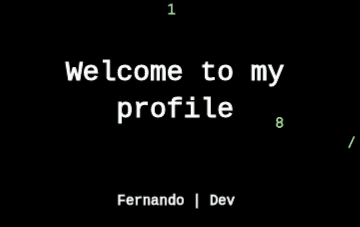

<!--**Nando-Freitas/Nando-Freitas** is a ✨ _special_ ✨ repository because its `README.md` (this file) appears on your GitHub profile.-->

- 🔭 I’m currently working on personal front-end projects
- 🌱 I’m currently learning react stack
- 👯 I’m looking to collaborate on open-source python and javascript projects
- 📫 How to reach me:  .

## Technologies

   

      
   

   

      These are languages and tools which I'm always improving
   

    
   

       &nbsp;&nbsp;&nbsp;&nbsp;&nbsp;&nbsp;&nbsp;&nbsp;
       &nbsp;&nbsp;&nbsp;&nbsp;&nbsp;&nbsp;&nbsp;&nbsp;
       &nbsp;&nbsp;&nbsp;&nbsp;&nbsp;&nbsp;&nbsp;&nbsp;
   

   

       &nbsp;&nbsp;&nbsp;&nbsp;&nbsp;&nbsp;&nbsp;&nbsp;
       &nbsp;&nbsp;&nbsp;&nbsp;&nbsp;&nbsp;&nbsp;&nbsp;
       &nbsp;&nbsp;&nbsp;&nbsp;&nbsp;&nbsp;&nbsp;&nbsp;&nbsp;  
   

   

       &nbsp;&nbsp;&nbsp;&nbsp;&nbsp;&nbsp;&nbsp;
       &nbsp;&nbsp;&nbsp;&nbsp;&nbsp;&nbsp;&nbsp;&nbsp;
       &nbsp;&nbsp;&nbsp;&nbsp;&nbsp;&nbsp;&nbsp;&nbsp;
   

   

       &nbsp;&nbsp;&nbsp;&nbsp;&nbsp;&nbsp;&nbsp;&nbsp;&nbsp;
       &nbsp;&nbsp;&nbsp;&nbsp;&nbsp;&nbsp;&nbsp;&nbsp;
   

 
 

## Status

   
